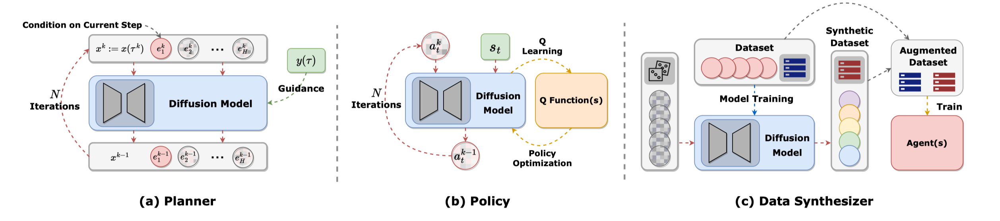

# Diffusion model for control and planning tutorial

Tutorial outline:

1. Recap: what is a diffusion model / what problem does it solve?
2. Motivation: why do we need a diffuser in control and planning?
3. Practice: how to use a diffuser in control and planning?
4. Literatures: recent research in a diffuser for control and planning
5. Summary & Limitations: what we can do and what we cannot do

## Recap: diffusion model

Diffusion model is a generative model that can generate samples from a given distribution. It is a powerful distribution matching tool that can match the distribution of the dataset, which is widely used in image generation, text generation, and other generative tasks.

The key component of the diffusion model is the score function, which is the gradient of the log probability of the data. Compared with directly learning the distribution, learning the score function given different noise levels is easier and more stable. 

$$
\boldsymbol{x}_{i+1} \leftarrow \boldsymbol{x}_i+c \nabla \log p\left(\boldsymbol{x}_i\right)+\sqrt{2 c} \boldsymbol{\epsilon}, \quad i=0,1, \ldots, K
$$

The unique properties of the diffusion model include:

* **Multimodal**: It can handle multimodal action distributions
* The method can be scaled to high-dimensional distribution matching problems. 
* With sound mathematical foundation and standard training procedure via multi-stage diffusion, it is stable to train.

## Motivation: why do we need a diffuser in control and planning?

From the control and planning perspective, there are lots of scenarios where we need to match the distribution of the dataset, such as: 

| Scenario | Challenge | Solution |
| --- | --- | --- |
| Imitation learning | Match the expert's action distribution with limited data. Common method like GAIL using adversarial training to match the distribution. BC cannot handle multimodal distribution. | Diffusion model can matching the distribution of the expert's action with high capacity and high expressiveness. |
| Offline reinforcement learning | Perform better than dataset with a large number of demonstrations. Here need to make sure the policy's action distribution is close to the dataset while improving the performance. Common method like CQL penalize OOD samples, make the method overconserative. | Diffusion model can match the dataset's action and regularize the policy's action distribution. |
| Model-based reinforcement learning | Match the dynamic model and (sometimes) policy's action distribution. First learning the model and then use the model to plan in a au
to-regressive manner. This method suffers from compounding error. | Diffusion model can handle non-autoregressive and multimodal distribution matching by predicting the whole trajectory sequence at once. |

Why does diffusion work here?
1. non-autoregressive (no sequential dependency): compounding error is not a problem, but still can generate any length of sequence with certain architecture choices
2. multimodal: can handle multimodal action distributions
3. matching the distribution: can match the distribution of the expert's action
4.  High capacity + high expressiveness: can handle high-dimensional action spaces -> foundation models, 50 demonstrations per task
5.  stable training: with a sound mathematical foundation and standard training procedure via multi-stage diffusion, it is stable to train

smooth

## Practice: how to use diffuser?

Things to diffuse: trajectory sequence as single channel image. 

Architecture choices:

* temporal convolutional network (TCN)

How to make it condition on certain objectives?

1. guidance function: directly shift the distribution / cost or learned value etc or train a discriminator (classifier) to get the guidance function.

$$
\begin{aligned}
\nabla \log p\left(\boldsymbol{x}_t \mid y\right) & =\nabla \log \left(\frac{p\left(\boldsymbol{x}_t\right) p\left(y \mid \boldsymbol{x}_t\right)}{p(y)}\right) \\
& =\nabla \log p\left(\boldsymbol{x}_t\right)+\nabla \log p\left(y \mid \boldsymbol{x}_t\right)-\nabla \log p(y) \\
& =\underbrace{\nabla \log p\left(\boldsymbol{x}_t\right)}_{\text {unconditional score }}+\underbrace{\nabla \log p\left(y \mid \boldsymbol{x}_t\right)}_{\text {adversarial gradient }}
\end{aligned}
$$

2. classifier-free method: does not need to train a classifier to get the guidance function, now two terms can be interpreted as unconditional score and conditional score.

$$
\begin{aligned}
\nabla \log p\left(\boldsymbol{x}_t \mid y\right) & =\nabla \log p\left(\boldsymbol{x}_t\right)+\gamma\left(\nabla \log p\left(\boldsymbol{x}_t \mid y\right)-\nabla \log p\left(\boldsymbol{x}_t\right)\right) \\
& =\nabla \log p\left(\boldsymbol{x}_t\right)+\gamma \nabla \log p\left(\boldsymbol{x}_t \mid y\right)-\gamma \nabla \log p\left(\boldsymbol{x}_t\right) \\
& =\underbrace{\gamma \nabla \log p\left(\boldsymbol{x}_t \mid y\right)}_{\text {conditional score }}+\underbrace{(1-\gamma) \nabla \log p\left(\boldsymbol{x}_t\right)}_{\text {unconditional score }}
\end{aligned}
$$

3. inpainting: fill the missing part of the distribution so as to constrains certain part of the distribution

## Literatures: research progress in a diffuser for control and planning

Axis1: how to get the score function

* Data-driven: learning from data by manually adding noise to the data
* Hybrid: learning from other optimization process
* Model-based: calculate analytical from the model

Axis2: what to diffuse

* action: directly diffuse for the next action
* state: learn the model
* state-sequence: diffuse for the next state sequence, or sometimes state-action sequence, or sometimes action sequence (for position control)

## Limitations: what are the challenges?

1. computational cost: The diffusion model needs a longer time to train (a few GPUs hours compared with tens of minutes) and inference (iterative sample steps compared with one forward pass). This makes high frequency control and planning difficult to use diffusion model.
2. handle shifting distribution: in online RL, the distribution of the policy will shift keep changing while adapting diffusion model to the new distribution need large amount of data and long time to train. This limit diffusion model to be trained in a fixed rather than dynamic dataset.
3. high variance: depends on initial guess and random sampling, the variance of the diffusion model is high, which limits its application in high precision or safety-critical tasks.
4. constrain satisfaction: the diffusion model is not guaranteed to satisfy the constraints, especially when tested in a constrain different from the training set. This limits its application in adapting to new constraints and tasks.

## Summary

* Why diffusion: stable training, multimodal (learn the field v.s. learn the gradient), scalable

## TODO

1. tutorial on a simple control problem
