# Diffusion Model for Control and Planning Tutorial

> Chaoyi Pan 2024.2.26

Tutorial outline:

1. 🔄 Recap: What is a Diffusion Model / What Problem Does It Solve?
2. 🚀 Motivation: Why Do We Need a Diffuser in Control and Planning?
3. 🛠️ Practice: How to Use a Diffuser in Control and Planning?
4. 📚 Literatures: Recent Research in a Diffuser for Control and Planning
5. 📝 Summary & Limitations: What We Can Do and What We Cannot Do

## 🔄 Recap: Diffusion Model

A diffusion model is a generative model capable of generating samples from a given distribution. It serves as a powerful tool for distribution matching, extensively utilized in image generation, text generation, and other creative tasks.

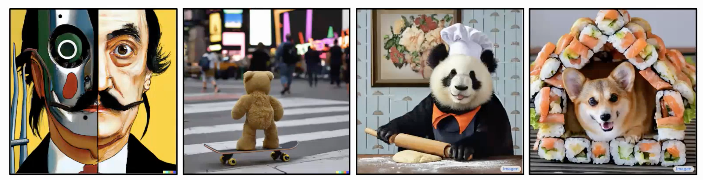

At the core of the diffusion model is the score function, representing the noise direction used to update samples to match the target distribution. Through learning this score function, the diffusion model can adeptly generate samples from the specified distribution.

$$
\boldsymbol{x}_{i+1} \leftarrow \boldsymbol{x}_i+c \nabla \log p\left(\boldsymbol{x}_i\right)+\sqrt{2 c} \boldsymbol{\epsilon}, \quad i=0,1, \ldots, K
$$

The diffusion model have several advantages over other generative models, including but not limited to the following:

* **Multimodal**: It effectively handles multimodal distributions, a challenge often encountered when directly predicting distributions.
* **Scalable**: This approach scales well with high-dimensional distribution matching problems, making it versatile for various applications.
* **Stable**: Grounded in solid math and a standard multi-stage diffusion training procedure, the model ensures stability during training.
* **Non-autoregressive**: Its capability to predict entire trajectory sequences in a non-autoregressive manner enables efficient handling of non-autoregressive and multimodal distribution matching challenges.

## 🚀 Motivation: Why Do We Need a Diffuser in Control and Planning?

**Generative Models in Control and Planning**

Before diffusion models became popular, there were other generative models used in control and planning. Below are a few examples of how other generative models have been applied in imitation learning: 

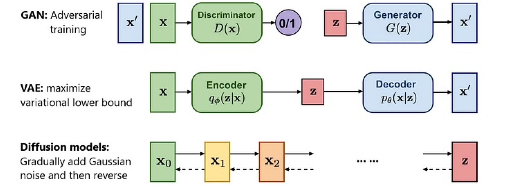

| Generative model | Application | Idea | Limitation |
| --- | --- | --- | --- |
| GAN | Generative Adversarial Imitation Learning (GAIL): Learning a discriminator and training a policy to fool the discriminator | 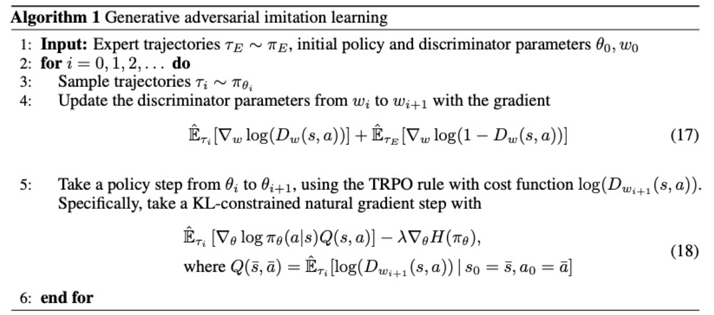 | Difficult to handle multimodal distributions and unstable training |
| VAE | Action Chunking with Transformers (ACT) ([ALOHA](https://tonyzhaozh.github.io/aloha/)): Learning a latent space (encoder: expert action sequence + observation -> latent) and using the latent space for planning (decoder: latent + more observation -> action sequence prediction) | 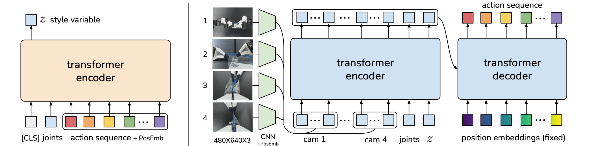 | Challenging to train | 

In these scenarios, the objective is to match the distribution of the dataset, similar to the goal of diffusion models. Compared with other generative models like GANs and VAEs, diffusion models are better at handling multimodal data and offer more stable training processes.

**What to Learn with the Generative Model?**

From a planning and reinforcement learning perspective, there are numerous scenarios where matching the dataset's distribution is crucial, such as:

| Scenario | Challenge | Solution | Illustrations |
| --- | --- | --- | --- |
| Imitation Learning | $\min \|\|p_\theta(\tau) - p_{\text{data}}(\tau)\|\|$ **Match the demonstrations**' trajectory distribution (high-dimensional+multi-modality) with limited data. Common methods like GAIL use adversarial training to match the distribution. | Diffusion models excel at matching the distribution of the expert's actions with high capacity and expressiveness. | 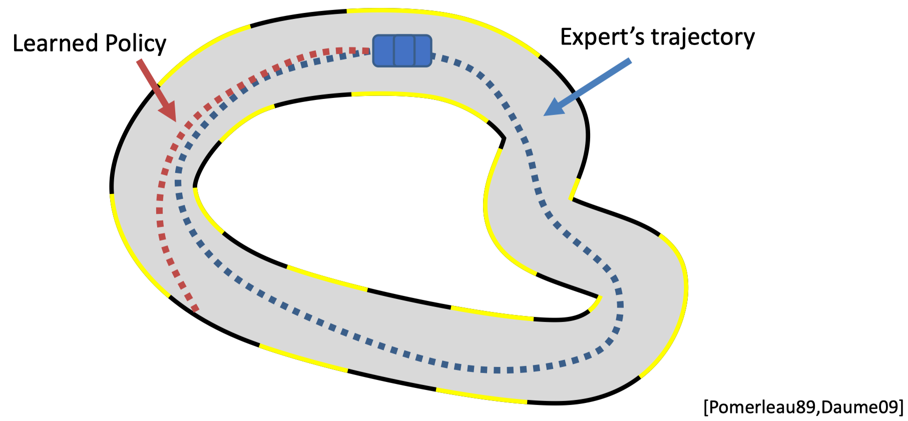|
| Offline Reinforcement Learning | $\max J_\theta(\tau) \ge J_\text{data}(\tau) \text{s.t.} \|\|p_\theta(\tau) - p_{\text{data}}(\tau)\|\| < \epsilon$ **Perform better than demonstrations** with a large number of demonstrations. Here, it's essential to ensure the policy's action distribution is close to the dataset while improving performance. Common methods like CQL penalize out-of-distribution (OOD) samples, making the method overly conservative. | Diffusion models can match the dataset's action and regularize the policy's action distribution effectively. | 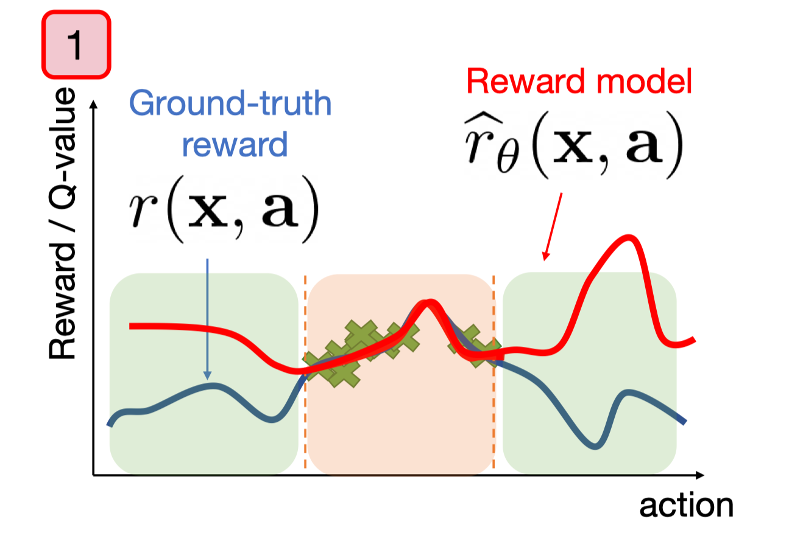|
| Model-based Reinforcement Learning | **Match the dynamic model** and (sometimes) the policy's action distribution. This involves first learning the model and then using it to plan in an autoregressive manner. This method suffers from compounding errors. | Diffusion models are adept at handling non-autoregressive and multimodal distribution matching by predicting the entire trajectory sequence at once. | 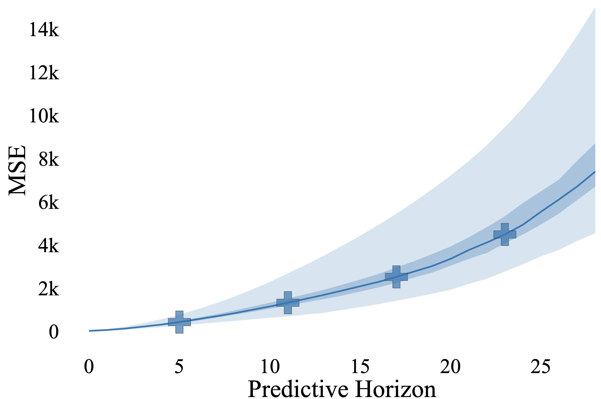|

Diffusion models can be utilized to learn the policy, the planner, or the model itself. Each of these applications can be viewed as a distribution matching problem. The next section will delve into the choices and implications of using diffusion models in these contexts.

## 🛠️ Practice: How to Use the Diffuser?

### What to Diffuse?

In practice, there are several ways to incorporate the diffusion model into control and planning. The most common method is known as the 'diffuser':

The diffuser operates by concatenating the state and action, allowing us to diffuse the state-action sequence. This process is akin to diffusing a single-channel image. The training of the model follows a similar approach to image generation. Initially, noise is added to the state-action sequence. Subsequently, the model is trained to predict the score function or noise vector. 

Here a local field method is implemented with a temporal convolutional network (TCN) to impose local consistency on the state-action sequence. 

| Task | Thing's to Diffuse | How to Diffuse |
|------|--------------------|----------------|
| Image Generation |  |  |
| Planning | 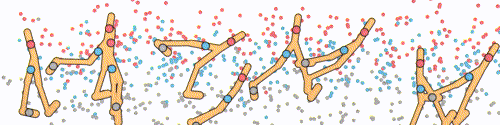 | 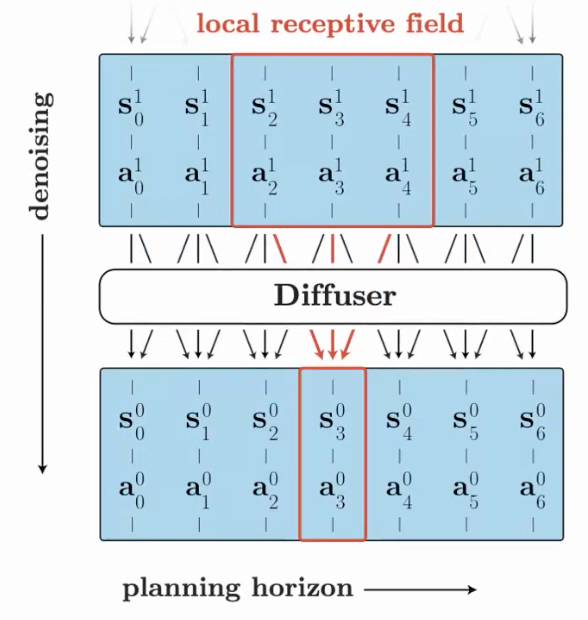 |

### How to Impose Constraints/Objectives?

However, when training a model with given trajectory data, this model can only replicate the same actions as in the data, which is not what we want. We want the model to generalize to new tasks and constraints. To achieve this, we need to make the model conditional on the task and constraints. There are a few ways to do this:

**Guidance Function**

The guidance function directly shifts the distribution/cost or learned value, etc., or trains a discriminator (classifier) to obtain the guidance function. There are two common ways to get the guidance function:

1. Predefined the guidance function: This approach is easy to implement but might lead to out-of-distribution (OOD) samples, breaking the learned distribution.

   $$
   \tilde{p}_\theta(\boldsymbol{\tau}) \propto p_\theta(\boldsymbol{\tau}) h(\boldsymbol{\tau}) \\
   \boldsymbol{\tau}^{i-1} = \mathcal{N}\left(\mu+\alpha \Sigma \nabla \mathcal{J}(\mu), \Sigma^i\right)
   $$

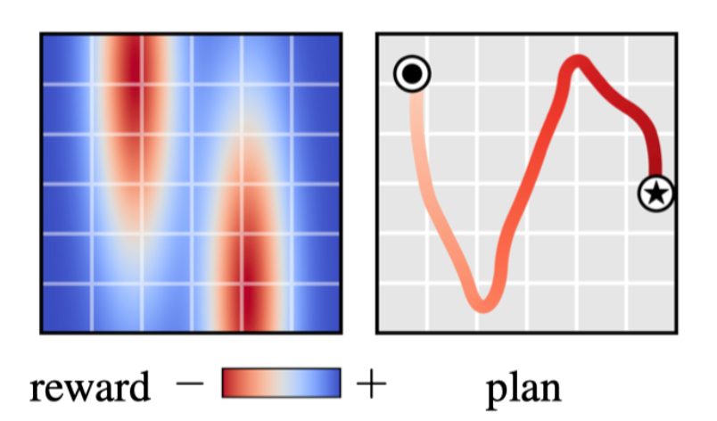

1. Learned guidance function: This approach is more common in training image generation models, which involves training a classifier to obtain the guidance function. However, this method requires training a classifier in an adversarial manner, which might lead to unstable training.

   $$
   \begin{aligned}
   \nabla \log p\left(\boldsymbol{x}_t \mid y\right) & =\nabla \log \left(\frac{p\left(\boldsymbol{x}_t\right) p\left(y \mid \boldsymbol{x}_t\right)}{p(y)}\right) \\
   & =\nabla \log p\left(\boldsymbol{x}_t\right)+\nabla \log p\left(y \mid \boldsymbol{x}_t\right)-\nabla \log p(y) \\
   & =\underbrace{\nabla \log p\left(\boldsymbol{x}_t\right)}_{\text {unconditional score }}+\underbrace{\nabla \log p\left(y \mid \boldsymbol{x}_t\right)}_{\text {adversarial gradient }}
   \end{aligned}
   $$

**Classifier-Free Method**

By performing the following transformation, we can obtain the guidance function without training a classifier. The two terms below are known as the unconditional score and the conditional score, respectively. In practice, we can omit the input of the conditional score to achieve the unconditional score.

$$
\begin{aligned}
\nabla \log p\left(\boldsymbol{x}_t \mid y\right) & =\nabla \log p\left(\boldsymbol{x}_t\right)+\gamma\left(\nabla \log p\left(\boldsymbol{x}_t \mid y\right)-\nabla \log p\left(\boldsymbol{x}_t\right)\right) \\
& =\nabla \log p\left(\boldsymbol{x}_t\right)+\gamma \nabla \log p\left(\boldsymbol{x}_t \mid y\right)-\gamma \nabla \log p\left(\boldsymbol{x}_t\right) \\
& =\underbrace{\gamma \nabla \log p\left(\boldsymbol{x}_t \mid y\right)}_{\text {conditional score }}+\underbrace{(1-\gamma) \nabla \log p\left(\boldsymbol{x}_t\right)}_{\text {unconditional score }}
\end{aligned}
$$

| Guidance Function Method | Classifier-Free Method |
| --- | --- |
| 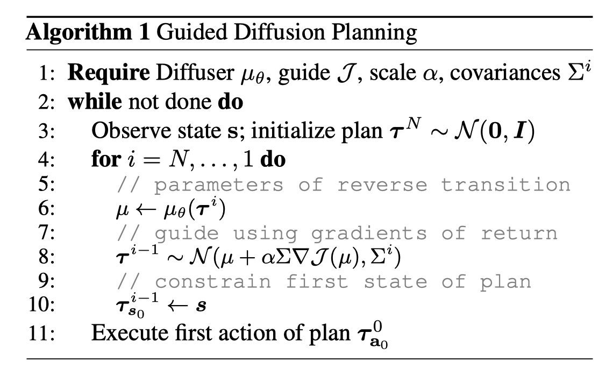 | 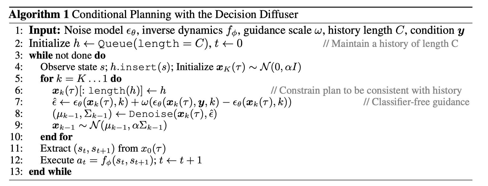 |

**Inpainting**

If the control problem involves specific state constraints (such as the initial/target state or constraints), we can simply fix the state and fill in the missing parts of the distribution. This approach is extremely useful in goal-reaching and navigation tasks.

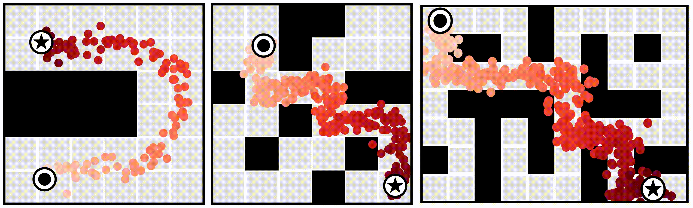

## 📚 Literatures: Research Progress in Diffusion Models for Control and Planning

A detailed summary of each method can be found [here](https://panchaoyi.notion.site/14ed102954ce4da79f146a641925afd7?v=a447d0b5d5a949dfbb18e253c3492a8f&pvs=4).

$$
\color{red}\underbrace{\nabla_x \log P}_{\text{how to get score function}}
\color{black}(
\color{blue}\underbrace{x}_{\text{what to diffuse}}
\color{black}|
\color{green}\underbrace{y}_{\text{how to impose constraints/objectives}}
\color{black})
$$

The heart of the diffusion model is understanding how to obtain the score function. Based on the methods for obtaining the score function, what to diffuse, and how to impose constraints/objectives, we can categorize the recent research in diffusion models for control and planning into the following three axes:

**Axis 1: How to Get the Score Function**

* Data-driven: Learning from data by manually adding noise
* Hybrid: Learning from another optimization process
* Model-based: Calculating analytically from the model

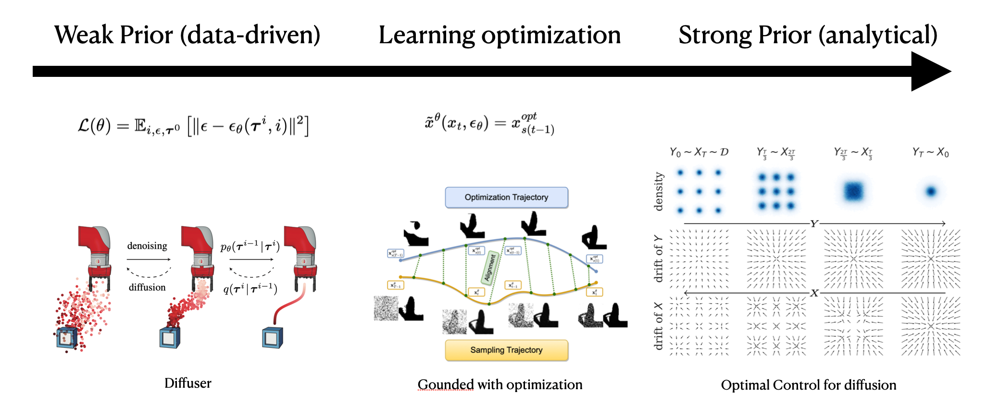

The data-driven method is the most common approach to obtaining the score function, which involves adding noise to the data and then training the model to predict the score function. The hybrid method learns the score function from the intermediate results of another optimization process, typically used in specific optimization problems. Finally, if you can calculate the score function analytically, then you can use Langevin dynamics to estimate the final distribution.

**Axis 2: What to Diffuse**

* Action: Directly diffuse for the next action
* State: Learn the model
* State-sequence: Diffuse for the next state sequence, or sometimes state-action sequence, or action sequence (for position control)

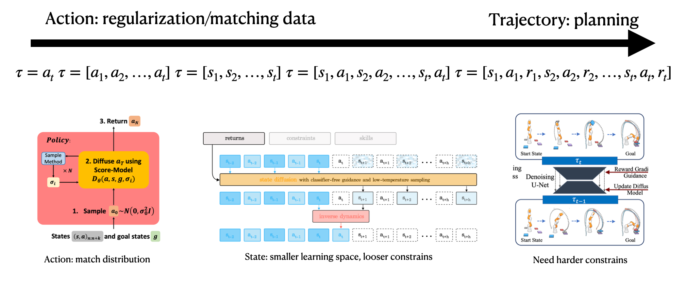

What to diffuse depends on the goals. For instance, to regularize the action distribution to the dataset, diffusing the action is suitable. To learn a dynamically feasible optimal trajectory, diffusing the state-sequence is appropriate. Sometimes, diffusing the action sequence makes execution easier, while other times inverse dynamics are needed to obtain the action sequence.

**Axis 3: How to Impose Constraints/Objectives**

* Guidance function: Predefined or learned
* Classifier-free: Use the unconditional score and conditional score
* Inpainting: Fix the state and fill in the missing parts of the distribution

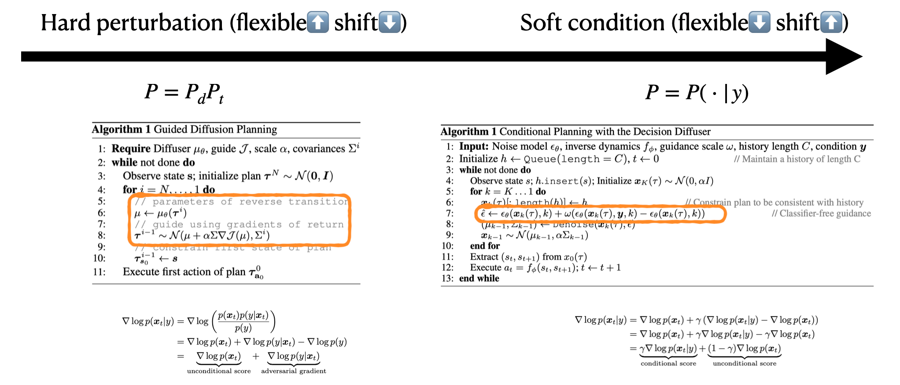

The guidance function is the easiest way to impose constraints/objectives, which involves multiplying the guidance function with the model's distribution. The classifier-free method uses the unconditional and conditional scores to impose constraints/objectives, as seen in methods like `decision diffuser`, `adaptive diffuser`, etc. Inpainting involves fixing the state and filling in the missing parts of the distribution, useful in goal-reaching or navigation tasks. This approach is complementary to the guidance function and classifier-free method.

One interesting work in this line called `safe diffuser` is to solve the quadratic programming (QP) problem at each step to add hard constraints. This method is useful in safety-critical tasks, where they prove that the diffusion model can satisfy the constraints if it converges.

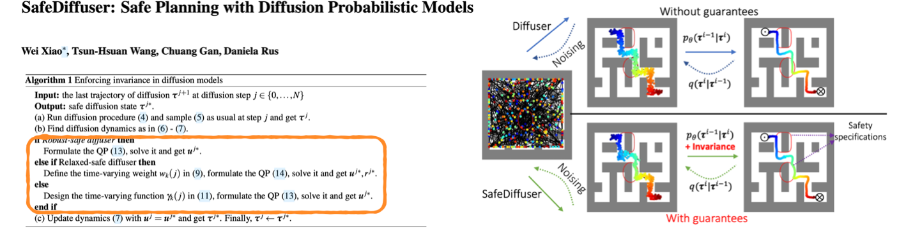

## 📝 Summary & Limitations: What are the Challenges?

From the above discussion, we can see that the diffusion model can be used in control and planning to match the distribution of the dataset, which is widely used in imitation learning, offline reinforcement learning, and model-based reinforcement learning. The diffusion model can be used to learn the policy, the planner, or the model, which can also be viewed as a distribution matching problem.

**Why Does Diffusion Work?**

Compared with learning the explicit policy directly or learning the energy-based model, the diffusion model can handle multimodal distribution and higher-dimensional distribution matching by iteratively predicting the score function. This greatly smooths the distribution matching process and makes the training more stable and scalable.

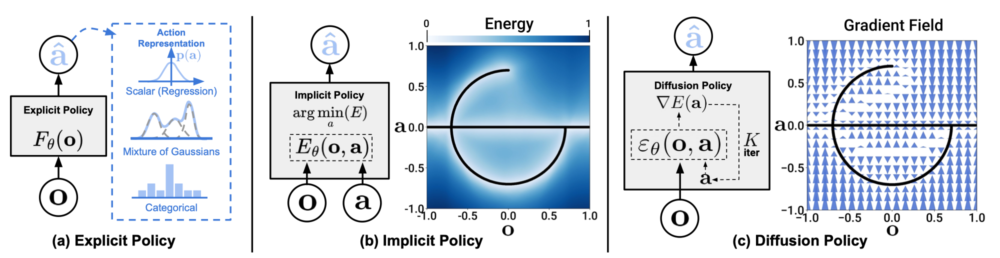

**Limitations**

However, the diffusion model also has its limitations, which include:

1. Computational cost: The diffusion model requires a longer time to train (a few GPU days compared with tens of minutes) and inference (iterative sample steps compared with one forward pass). This makes high-frequency control and planning difficult to use with the diffusion model.
2. Handling shifting distribution: In online RL, the distribution of the policy will keep changing. Adapting the diffusion model to the new distribution requires a large amount of data and a long time to train. This limits the diffusion model to be trained in a fixed rather than a dynamic dataset.
3. High variance: Depending on the initial guess and random sampling, the variance of the diffusion model is high, which limits its application in high-precision or safety-critical tasks.
4. Constraint satisfaction: The diffusion model does not guarantee to satisfy the constraints, especially when tested in a constraint different from the training set. This limits its application in adapting to new constraints and tasks.
