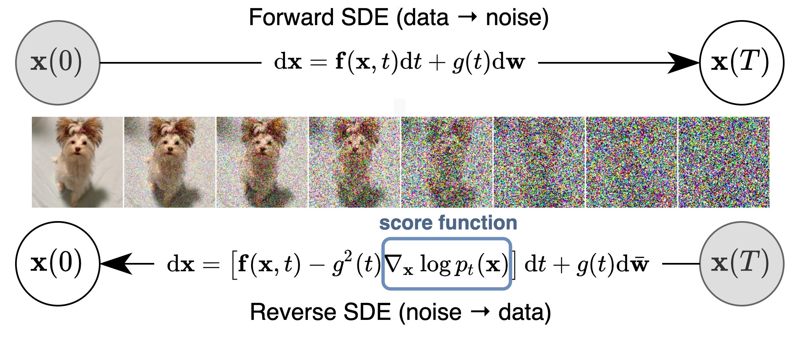

# Diffusion model for control and planning tutorial

Tutorial outline:

1. Recap: what is a diffusion model / what problem does it solve?
2. Motivation: why do we need a diffuser in control and planning?
3. Practice: how to use a diffuser in control and planning?
4. Literatures: recent research in a diffuser for control and planning
5. Summary & Limitations: what we can do and what we cannot do

## Recap: diffusion model

Diffusion model is a generative model that can generate samples from a given distribution. It is a powerful distribution matching tool that can match the distribution of the dataset, which is widely used in image generation, text generation, and other generative tasks.

The key component of the diffusion model is the score function, which is the noise direction that can be used to update the sample to match the distribution. By learning the score function, the diffusion model can generate samples from the given distribution.

$$
\boldsymbol{x}_{i+1} \leftarrow \boldsymbol{x}_i+c \nabla \log p\left(\boldsymbol{x}_i\right)+\sqrt{2 c} \boldsymbol{\epsilon}, \quad i=0,1, \ldots, K
$$

The unique properties of the diffusion model include:

* **Multimodal**: It can handle multimodal distributions, which is hard to learn my directly predicting the distribution.
* **Scalable**: The method can be scaled to high-dimensional distribution matching problems.
* **Stable**: With a sound mathematical foundation and standard training procedure via multi-stage diffusion, it is stable to train.
* **Non-autoregressive**: It can handle non-autoregressive and multimodal distribution matching by predicting the whole trajectory sequence at once.

## Motivation: why do we need a diffuser in control and planning?

**Generative models in control and planning**

Before diffusion model becomes popular, there are other generative models that are used in control and planning. Here are a few examples of using other generative models for imitation learning: 

| Generative model | Application | Idea | Limitation |
| --- | --- | --- | --- |
| GAN | Generative adversarial imitation learning (GAIL): learn a discriminator and train a policy to fool the discriminator |  | Hard to handle multimodal distribution and unstable to train |
| VAE | Action Chunking with Transformers (ACT) ([ALOHA](https://tonyzhaozh.github.io/aloha/)): learn a latent space (encoder: expert action sequence + observation -> latent) and use the latent space to plan (decoder: latent + more observation -> action sequence prediction) |  | Harder to train | 

In the above scenarios, we need to match the distribution of the dataset, which is the same as the diffusion model's goal. Compared with other generative models like GAN and VAE, the diffusion model can handle multimodal data better and is more stable to train.

**What to learn with the generative model?**

From the planning/reinforcement learning perspective, there are lots of scenarios where we need to match the distribution of the dataset, such as:

| Scenario | Challenge | Solution | Illustrations |
| --- | --- | --- | --- |
| Imitation learning | $\min \|\|p_\theta(\tau) - p_{\text{data}}(\tau)\|\|$ **Match the demostrations**'s trajectory distribution (high-dimensional) with limited data. Common method like GAIL using adversarial training to match the distribution. | Diffusion model can matching the distribution of the expert's action with high capacity and high expressiveness. | |
| Offline reinforcement learning | $\max J_\theta(\tau) \ge J_\text{data}(\tau) \text{s.t.} \|\|p_\theta(\tau) - p_{\text{data}}(\tau)\|\| < ϵ$ **Perform better than demostrations** with a large number of demonstrations. Here need to make sure the policy's action distribution is close to the dataset while improving the performance. Common method like CQL penalize OOD samples, make the method overconserative. | Diffusion model can match the dataset's action and regularize the policy's action distribution. | |
| Model-based reinforcement learning | **Match the dynamic model** and (sometimes) policy's action distribution. First learning the model and then use the model to plan in a auto-regressive manner. This method suffers from compounding error. | Diffusion model can handle non-autoregressive and multimodal distribution matching by predicting the whole trajectory sequence at once. | |

Also, the diffusion model can be used to learn the policy, the planner or the model, which can also be viewed as a distribution matching problem. We will discuss this choice in the next section.

## Practice: how to use the diffuser?

### What to diffuse?

In practice, there are a few ways to incorporate the diffusion model into control and planning. Here is the most common way called diffuser:

By concatenating the state and action, we can diffuse the state-action sequence, which is like diffusing a single-channel image. The training of the model is also the same as the image generation. First, add noise to the state-action sequence and then train the model to predict the score function / noise vector that can be used to update the state-action sequence to match the distribution. 

|Task|Thing's to diffuse|How to diffuse|
|---|---|---|
|Image generation|||
|Planning|||

### How to impose constraints/objectives?

However, when training a model with given trajectory data, this model can only do the same thing as the data, which is not what we want. We want the model can generalize to new tasks and constraints. Here we need make the model conditional on the task and constraints. There are a few ways to do this:

**guidance function**

The guidance function directly shifts the distribution/cost or learned value etc or trains a discriminator (classifier) to get the guidance function. There are two common ways to get the guidance function:

Predefined the guidance function: this way is easy to implement but might lead to OOD samples, which broken the learned distribution.

$$
\tilde{p}_\theta(\boldsymbol{\tau}) \propto p_\theta(\boldsymbol{\tau}) h(\boldsymbol{\tau})
$$

Learned guidance function: this way is more common in training image generation models, which is to train a classifier to get the guidance function. However, this way needs to train a classifier in an adversarial manner, which might leads to unstable training.

$$
\begin{aligned}
\nabla \log p\left(\boldsymbol{x}_t \mid y\right) & =\nabla \log \left(\frac{p\left(\boldsymbol{x}_t\right) p\left(y \mid \boldsymbol{x}_t\right)}{p(y)}\right) \\
& =\nabla \log p\left(\boldsymbol{x}_t\right)+\nabla \log p\left(y \mid \boldsymbol{x}_t\right)-\nabla \log p(y) \\
& =\underbrace{\nabla \log p\left(\boldsymbol{x}_t\right)}_{\text {unconditional score }}+\underbrace{\nabla \log p\left(y \mid \boldsymbol{x}_t\right)}_{\text {adversarial gradient }}
\end{aligned}
$$

**classifier-free method**

By doing the following transformation, we can get the guidance function without training a classifier. The two terms below are called unconditional score and conditional score, respectively. In practice, we can drop out the input of the conditional score to get the unconditional score.

$$
\begin{aligned}
\nabla \log p\left(\boldsymbol{x}_t \mid y\right) & =\nabla \log p\left(\boldsymbol{x}_t\right)+\gamma\left(\nabla \log p\left(\boldsymbol{x}_t \mid y\right)-\nabla \log p\left(\boldsymbol{x}_t\right)\right) \\
& =\nabla \log p\left(\boldsymbol{x}_t\right)+\gamma \nabla \log p\left(\boldsymbol{x}_t \mid y\right)-\gamma \nabla \log p\left(\boldsymbol{x}_t\right) \\
& =\underbrace{\gamma \nabla \log p\left(\boldsymbol{x}_t \mid y\right)}_{\text {conditional score }}+\underbrace{(1-\gamma) \nabla \log p\left(\boldsymbol{x}_t\right)}_{\text {unconditional score }}
\end{aligned}
$$

| Guidance function method | Classifier-free method |
| --- | --- |
|  |  |

**inpainting**

If the control problem has specific state constraints (like the initial/target state or constrains), we can just fix the state and fill the missing part of the distribution. This is very useful in goal-reaching tasks/ navigation tasks.

## Literatures: research progress in a diffuser for control and planning

The heart of diffusion model is how to get the score function. According how to get the score function, what to diffuse and how to impose constraints/objectives, we can categorize the recent research in a diffuser for control and planning into the following three axes:

$$

\color{red}\underbrace{\nabla_x \log P}_{\text{how to get score function}}
\color{black}(
\color{blue}\underbrace{x}_{\text{what to diffuse}}
\color{black}|
\color{green}\underbrace{y}_{\text{how to impose constraints/objectives}}
\color{black})
$$

**Axis1: how to get the score function**

* Data-driven: learning from data by manually adding noise to the data
* Hybrid: learning from another optimization process
* Model-based: calculate analytical from the model

The detailed summary of each method can be find [here](https://panchaoyi.notion.site/14ed102954ce4da79f146a641925afd7?v=a447d0b5d5a949dfbb18e253c3492a8f&pvs=4)

The data-driven method is the most common way to get the score function, which is to add noise to the data and then train the model to predict the score function. The hybrid method is to learn the score function from another optimization process's intermediate result, which is used in specific optimization problem. Lastly, if you can analytically calculate the score function, then you can use the langevin dynamics to esitimate the final distribution. 

**Axis2: what to diffuse**

* action: directly diffuse for the next action
* state: learn the model
* state-sequence: diffuse for the next state sequence, or sometimes state-action sequence, or sometimes action sequence (for position control)

The things to diffuse depends the things want to achieve. For example, if we want to regularize the action distribution to the dataset, we can diffuse the action. If we want to learn dynamic feasible optimal trajectory, then we can diffuse the state-sequence. Sometimes people also diffuse the action sequence to make the execution easier, other times we need inverse dynamics to get the action sequence.

**Axis3: how to impose constraints/objectives**

* guidance function: predefined or learned
* classifier-free: use the unconditional score and conditional score
* inpainting: fix the state and fill in the missing part of the distribution

The guidance function is the easist way to impose constraints/objectives, which is to multiply the guidance function with the model's distribution. The classifier-free method is to use the unconditional score and conditional score to impose constraints/objectives which is used in method like `decision diffuser`, `adaptive diffuser` etc. The inpainting is to fix the state and fill in the missing part of the distribution, which is used in goal-reaching tasks/ navigation tasks, this is complimentary to the guidance function and classifier-free method.

## Conclusion & Limitations: what are the challenges?

From the above discussion, we can see that the diffusion model can be used in control and planning to match the distribution of the dataset, which is widely used in imitation learning, offline reinforcement learning, and model-based reinforcement learning. The diffusion model can be used to learn the policy, the planner or the model, which can also be viewed as a distribution matching problem. 

**Why does diffusion works?**

Compared with learning the explicit policy directly or learning the energy-based model, the diffusion model can handle multimodal distribution and higher-dimensional distribution matching by iteratively predicting the score function. This greatly smooths the distribution matching process and makes the training more stable and scalable.

**Limitations**

However, the diffusion model also has its limitations, which include:

1. computational cost: The diffusion model needs a longer time to train (a few GPUs hours compared with tens of minutes) and inference (iterative sample steps compared with one forward pass). This makes high frequency control and planning difficult to use diffusion model.
2. handle shifting distribution: in online RL, the distribution of the policy will shift keep changing while adapting diffusion model to the new distribution need large amount of data and long time to train. This limit diffusion model to be trained in a fixed rather than dynamic dataset.
3. high variance: depends on initial guess and random sampling, the variance of the diffusion model is high, which limits its application in high precision or safety-critical tasks.
4. constrain satisfaction: the diffusion model is not guaranteed to satisfy the constraints, especially when tested in a constrain different from the training set. This limits its application in adapting to new constraints and tasks.

## TODO

1. tutorial on a simple control problem
