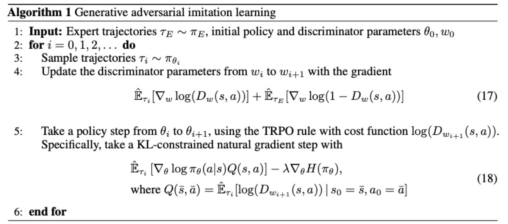
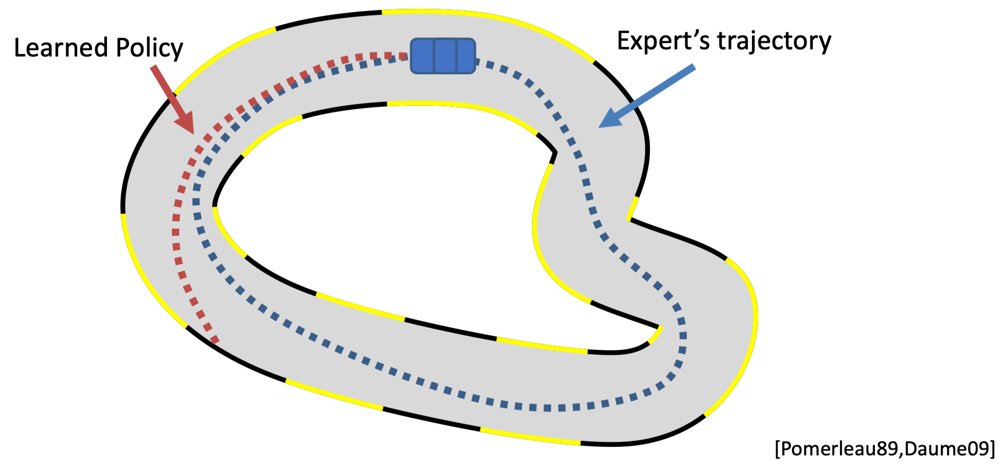
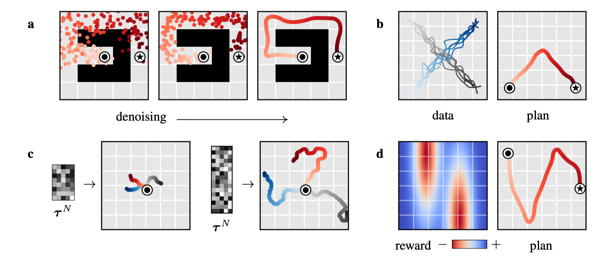
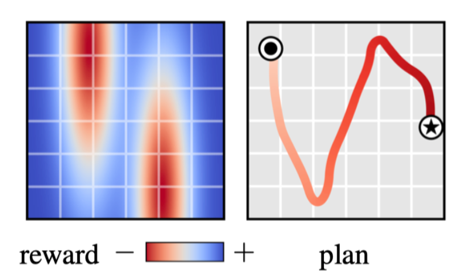

# 📚 Tutorial: Diffusion Model for Control and Planning

---
transition: fade
class: text-left
---

# 🔄 Recap: What is a Diffusion Model?

- Keynote: Generative model for distribution matching.
- Applications: Image and text generation, creative tasks.

---

# 🔄 Recap: Core of Diffusion Model

- Keynote: Generative model for distribution matching.
- Applications: Image and text generation, creative tasks.
- Core: Score function for sample generation and distribution description.
$$
\boldsymbol{x}_{i+1} \leftarrow \boldsymbol{x}_i+c \nabla \log p\left(\boldsymbol{x}_i\right)+\sqrt{2 c} \boldsymbol{\epsilon}, \quad i=0,1, \ldots, K
$$

---

# 🔄 Recap: Advantages of Diffusion Model

- Keynote: Generative model for distribution matching.
- Applications: Image and text generation, creative tasks.
- Core: Score function for sample generation and distribution description.
- Advantages:
    <v-clicks>

    - 🌟 Multimodal: Effective with multimodal distributions.
    - 📈 Scalable: Suits high-dimensional problems.
    - 🔒 Stable: Grounded in solid mathematics and training.
    - 🔄 Non-autoregressive: Predicts entire trajectories efficiently.

    </v-clicks>

---

# 🚀 Motivation: Why a Generative Model in Control and Planning?

## Generative Models in Control and Planning

- Generative Models: application in imitation learning to match expert data.
- Examples: GANs, VAEs in imitation learning.

---

# 🚀 Motivation: Why a Generative Model in Control and Planning?

## Generative Models in Control and Planning

- Generative Models: application in imitation learning to match expert data.
- Examples: GANs, VAEs in imitation learning.
- GAN in GAIL: Discriminator learning and policy training.
  - Idea: Train a discriminator to distinguish between expert and agent data.
  - Limitation: Struggles with multimodal distributions, unstable training.

---

# 🚀 Motivation: Why a Generative Model in Control and Planning?

## Generative Models in Control and Planning

- Generative Models: Crucial in control and planning.
- Examples: GANs, VAEs in imitation learning.
- VAE in ACT ([ALOHA](https://tonyzhaozh.github.io/aloha/)): Latent space learning for planning.
  - Idea: learn a latent space for planning and control. (generate action in chunks)
  - Limitation: hard to train. 

---
layout: iframe

url: https://tonyzhaozh.github.io/aloha/
---

---

# 🚀 Motivation: Why a Generative Model in Control and Planning?

## What to Learn with the Generative Model?

Scenario: Imitation Learning $\min \|p_\theta(\tau) - p_{\text{data}}(\tau)\|$

- Challenge: Match high-dimensional, multimodal trajectory distributions.
- Solution: Diffusion models for expressive distribution matching.
- Common Method: GAIL with adversarial training.
- Limitation: Struggles with multimodal distributions, unstable training.

---

# 🚀 Motivation: Why a Generative Model in Control and Planning?

## What to Learn with the Generative Model?

Scenario: Offline Reinforcement Learning $\max J_\theta(\tau) \ge J_\text{data}(\tau) \text{s.t.} \|p_\theta(\tau) - p_{\text{data}}(\tau)\| < \epsilon$

- Challenge: Outperform demonstrations, ensure close action distribution.
- Solution: Diffusion models to match action distribution effectively.
- Common Method: CQL, penalizes out-of-distribution samples.
- Limitation: over-conservative. 

---

# 🚀 Motivation: Why a Generative Model in Control and Planning?

## What to Learn with the Generative Model?

Scenario: Model-based Reinforcement Learning

- Challenge: Match dynamic model and policy's action distribution.
- Solution: Diffusion models for non-autoregressive, multimodal matching.
- Common method: planning with learned dynamics.
- Limitation: compounding error in long-horizon planning.

---

# 🚀 Motivation: Why a Generative Model in Control and Planning?

## What to Learn with the Generative Model?

Key: using a powerful model to matching a high-dimensional, multimodal distribution.

- Action/Value distribution matching: grounded in demostrations -> offline RL. 
- Trajectory distribution matching: dynamic feasibility and optimal trajectory distribution -> model-based RL.
- Transition distribution matching: dynamics matching in a non-autoregressive manner -> model-based RL.

---

# 🛠️ Practice: How to Use the Diffuser?

## What to Diffuse?

- Most common: diffuse trajectory (`diffuser`).
- Diffused variable `x`: state, action sequence. $\tau = \{s_0, a_0, s_1, a_1, \ldots, s_T, a_T\}$.

| Task | Thing's to Diffuse | How to Diffuse |
|------|--------------------|----------------|
| Image Generation |  |  |
| Planning |  |  |

---
layout: iframe

url: https://diffusion-planning.github.io
---

---

# 🛠️ Practice: How to Use the Diffuser?

### How to Impose Constraints/Objectives?

- Objective: make the trained model can generalize to new constraints and tasks. 
- Common case: goal-conditioned, safety, new task etc. 
- Possible Methods:
    <v-clicks>

    - Guidance function (d): shift distribution with extra gradient.
    - Classifier-free method: learn a model can both represent conditional and unconditional distribution.
    - Inpainting (a): fill in the missing part of the trajectory by fixing certain start and end state.
    
    </v-clicks>

---

# 🛠️ Practice: How to Use the Diffuser?

### How to Impose Constraints/Objectives?

- Guidance function: shift distribution with extra gradient.
  - Predefined the guidance function: 
    - Method: shift distribution with a manually defined function
    - Limitation: Might lead to OOD samples, which break the learned diffusion process.

$$
\tilde{p}_\theta(\boldsymbol{\tau}) \propto p_\theta(\boldsymbol{\tau}) h(\boldsymbol{\tau}) \\
\boldsymbol{\tau}^{i-1} = \mathcal{N}\left(\mu+\alpha \Sigma \nabla \mathcal{J}(\mu), \Sigma^i\right)
$$

---

# 🛠️ Practice: How to Use the Diffuser?

### How to Impose Constraints/Objectives?

- Guidance function: shift distribution with extra gradient. <v-click> ▶️ leads to OOD samples </v-click>
  - Predefined the guidance function: 
    - Method: shift distribution with a manually defined function
    - Limitation: Might lead to OOD samples, which break the learned diffusion process.
  - Learned classifier: 
    - Method: learning a classifier to distinguish between different constraints. (similar to GAN)
    - Limitation: Hard to tune parameters. 

$$
\begin{aligned}
\nabla \log p\left(\boldsymbol{x}_t \mid y\right) & =\nabla \log \left(\frac{p\left(\boldsymbol{x}_t\right) p\left(y \mid \boldsymbol{x}_t\right)}{p(y)}\right) \\
& =\nabla \log p\left(\boldsymbol{x}_t\right)+\nabla \log p\left(y \mid \boldsymbol{x}_t\right)-\nabla \log p(y) \\
& =\underbrace{\nabla \log p\left(\boldsymbol{x}_t\right)}_{\text {unconditional score }}+\underbrace{\nabla \log p\left(y \mid \boldsymbol{x}_t\right)}_{\text {adversarial gradient }}
\end{aligned}
$$

---

# 🛠️ Practice: How to Use the Diffuser?

### How to Impose Constraints/Objectives?

- Guidance function: shift distribution with extra gradient. ▶️ leads to OOD samples 
- Classifier-Free Method: learn a model can both represent conditional and unconditional distribution.
  - Method: drop out the condition term to learn a model can represent both conditional and unconditional distribution.

$$
\begin{aligned}
\nabla \log p\left(\boldsymbol{x}_t \mid y\right) & =\nabla \log p\left(\boldsymbol{x}_t\right)+\gamma\left(\nabla \log p\left(\boldsymbol{x}_t \mid y\right)-\nabla \log p\left(\boldsymbol{x}_t\right)\right) \\
& =\nabla \log p\left(\boldsymbol{x}_t\right)+\gamma \nabla \log p\left(\boldsymbol{x}_t \mid y\right)-\gamma \nabla \log p\left(\boldsymbol{x}_t\right) \\
& =\underbrace{\gamma \nabla \log p\left(\boldsymbol{x}_t \mid y\right)}_{\text {conditional score }}+\underbrace{(1-\gamma) \nabla \log p\left(\boldsymbol{x}_t\right)}_{\text {unconditional score }}
\end{aligned}
$$

---

# 🛠️ Practice: How to Use the Diffuser?

### How to Impose Constraints/Objectives?

- Guidance function: shift distribution with extra gradient. ▶️ leads to OOD samples 
- Classifier-Free Method: learn a model can both represent conditional and unconditional distribution.

| Guidance Function Method | Classifier-Free Method |
| --- | --- |
|  |  |

---

# 🛠️ Practice: How to Use the Diffuser?

### How to Impose Constraints/Objectives?

- Guidance function: shift distribution with extra gradient. ▶️ leads to OOD samples 
- Classifier-Free Method: learn a model can both represent conditional and unconditional distribution.
- Inpainting: fill in the missing part of the trajectory by fixing certain start and end state.
  - Method: fix the start and end state, and fill in the missing part of the trajectory.

---

# 🛠️ Practice: How to Use the Diffuser?

* Common thing to diffuse: trajectory. 
* Common way to impose constraints/add objectives: guidance function, classifier-free method, inpainting.

---

# 📚 Literatures: Recent Research Progress in Diffusion for RL/Control

A detailed summary of each method can be found [here](https://panchaoyi.notion.site/14ed102954ce4da79f146a641925afd7?v=a447d0b5d5a949dfbb18e253c3492a8f&pvs=4).

The key of diffusion: how to get the score function. 

$$
\color{red}\underbrace{\nabla_x \log P}_{\text{how to get score function}}
\color{black}(
\color{blue}\underbrace{x}_{\text{what to diffuse}}
\color{black}|
\color{green}\underbrace{y}_{\text{how to impose constraints/objectives}}
\color{black})
$$

<v-clicks>

- How to get score function: data-driven v.s. analytical.
- What to diffuse: sequential v.s. non-sequential.
- How to impose constraints/objectives: hard v.s. soft. 

</v-clicks>

---

# 📚 Literatures: Recent Research Progress in Diffusion for RL/Control

$$
\color{red}\underbrace{\nabla_x \log P}_{\text{how to get score function}}
\color{black}(
\color{blue}\underbrace{x}_{\text{what to diffuse}}
\color{black}|
\color{green}\underbrace{y}_{\text{how to impose constraints/objectives}}
\color{black})
$$

- How to get score function: data-driven v.s. analytical.
  - Data-driven: learn the score function from data.
  - Hybrid: learning from optimization intermediate results.
  - Analytical: use the analytical score function.

---

# 📚 Literatures: Recent Research Progress in Diffusion for RL/Control

$$
\color{red}\underbrace{\nabla_x \log P}_{\text{how to get score function}}
\color{black}(
\color{blue}\underbrace{x}_{\text{what to diffuse}}
\color{black}|
\color{green}\underbrace{y}_{\text{how to impose constraints/objectives}}
\color{black})
$$

- How to get score function: data-driven v.s. analytical.
- What to diffuse: sequential v.s. non-sequential.
  - Action/Value: learn a model to match action/value distribution, serve as regularizer and policy. 
  - Transition: learn a model to match transition distribution, serve as a world mode. ▶️ MPC
  - Trajectory: learn a model to match trajectory distribution, serve as a TO solver. (planning state v.s. state-action v.s. action)

---

# 📚 Literatures: Recent Research Progress in Diffusion for RL/Control

$$
\color{red}\underbrace{\nabla_x \log P}_{\text{how to get score function}}
\color{black}(
\color{blue}\underbrace{x}_{\text{what to diffuse}}
\color{black}|
\color{green}\underbrace{y}_{\text{how to impose constraints/objectives}}
\color{black})
$$

- How to get score function: data-driven v.s. analytical.
- What to diffuse: sequential v.s. non-sequential.
- How to impose constraints/objectives: hard v.s. soft. 
  - Guidance function: Predefined or learned
  - Classifier-free: Use the unconditional score and conditional score (most common)
  - Inpainting: Fix the state and fill in the missing parts of the distribution (complimentary to the other two)

---

# 📚 Literatures: Recent Research Progress in Diffusion for RL/Control

$$
\color{red}\underbrace{\nabla_x \log P}_{\text{how to get score function}}
\color{black}(
\color{blue}\underbrace{x}_{\text{what to diffuse}}
\color{black}|
\color{green}\underbrace{y}_{\text{how to impose constraints/objectives}}
\color{black})
$$

- How to get score function: data-driven v.s. analytical.
- What to diffuse: sequential v.s. non-sequential.
- How to impose constraints/objectives: hard v.s. soft. 

---

# 📝 Summary & Challenges in Diffusion Models

<v-clicks>

- Diffusion in robotics: matches demostration distribution from data.
- Use cases: imitation learning, offline RL, model-based RL.
- Role: Learns policy, trajectory, or model as a regularizer/world model/planner.

</v-clicks>

---

# 📝 Summary & Challenges in Diffusion Models

- Diffusion in robotics: matches dataset distribution in control and planning.
- Use cases: imitation learning, offline RL, model-based RL.
- Role: Learns policy, planner, or model as a distribution matching problem.
- Advantages: high-dimensional matching, stability, scalability.

---

# 📝 Summary & Challenges in Diffusion Models

- Diffusion in robotics: matches dataset distribution in control and planning.
- Use cases: imitation learning, offline RL, model-based RL.
- Role: Learns policy, planner, or model as a distribution matching problem.
- Challenges: 
    <v-clicks>

    - 🕒 Computational cost: longer training and inference time.
    - 🔀 Shifting distribution: difficulties in adapting to dynamic datasets.
    - 📊 High variance: inconsistent performance in precision tasks.
    - ⛔ Constraint satisfaction: limited adaptability to new constraints.

    </v-clicks>

---
class: text-center
---

#  🎉 Thank you!

## Useful Resources

[Paper list with labels](https://panchaoyi.notion.site/14ed102954ce4da79f146a641925afd7?v=a447d0b5d5a949dfbb18e253c3492a8f&pvs=4)

[Diffusion for RL survey paper](https://arxiv.org/abs/2311.01223)

[Diffusion for RL repo](https://github.com/apexrl/Diff4RLSurvey)

[Awesome Diffusion RL repo](https://github.com/opendilab/awesome-diffusion-model-in-rl)